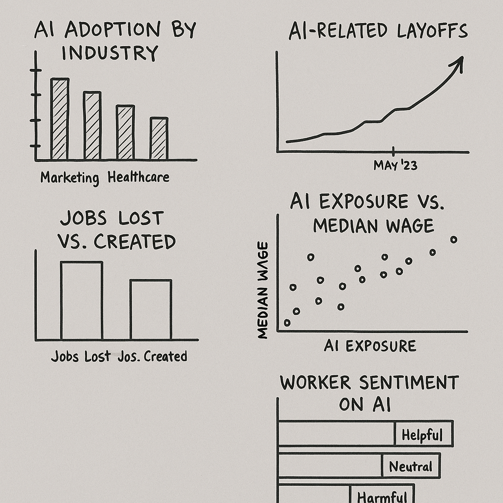

| [home page]((https://smadinen7.github.io/saipranav_tswd-portfolio/)) | [data viz examples](dataviz-examples) | [critique by design](critique-by-design) | [final project I](final-project-part-one) | [final project II](final-project-part-two) | [final project III](final-project-part-three) |

# Outline

## Project Summary  
Artificial Intelligence (AI) has rapidly evolved from a futuristic concept to something that’s already affecting our daily lives — especially in the workplace. For my final project, I’ll explore the impact of AI on the job market. This includes how AI is automating certain job roles, which industries are being most affected, and what new job opportunities are emerging as a result.

Rather than taking a general approach, I want to tell a focused story on how AI is *reshaping* — not just *replacing* — jobs. The goal is to create a clear and engaging narrative, supported by data, that helps the audience understand what’s really happening with AI and employment.

## Project Structure (Story Arc from *Good Charts*)

- **Introduction**: Show how AI is becoming more common across industries. Include stats about adoption and how it’s not just a “tech” thing anymore.
- **Build-up**: Highlight the rise in AI tools at work and how some job tasks are already being automated.
- **Tension**: Show the conflict — jobs are being lost due to AI (especially repetitive roles), but at the same time, AI-related jobs are growing. 
- **Turning Point**: Explain how workers and companies can adapt by learning new skills and redesigning work.
- **Resolution**: Offer a conclusion that AI doesn’t necessarily “take jobs” — it changes what work looks like, and the best way forward is through adaptation.

### One-Sentence Summary  
AI is transforming the job market by automating some roles while creating new ones, and we need to prepare for this shift.

### Target Users  
- Early-career professionals choosing paths  
- Policy makers and educators designing programs  
- Anyone curious about how AI will affect their job

---

## Initial sketches

> Post images of your anticipated data visualizations (sketches are fine). They should mimic aspects of your outline, and include elements of your story.

  

Planned visualizations:
1. **Bar Chart** – AI adoption by industry (e.g., marketing, healthcare, education)
2. **Timeline** – When AI-related job cuts started appearing in layoff reports
3. **Side-by-Side Bars** – Jobs lost vs. jobs gained (World Economic Forum)
4. **Scatter Plot** – Job exposure to AI vs. salary (e.g., “Data Entry Keyers” vs. “Barbers”)
5. **Stacked Bars** – How workers feel about AI (helpful/harmful/neutral)

---

# The data

I plan to use public datasets that provide both global and U.S.-level information on AI adoption and its impact on jobs. The World Economic Forum report outlines projections of job loss and creation due to AI over the next few years. Pew Research provides a detailed analysis of U.S. job roles and how likely they are to be affected based on the tasks involved. I’ll also use layoff data from Challenger, Gray & Christmas to show real-time displacement happening in 2023 and 2024. Together, these sources should help show both the risks and the opportunities.

I’ve started downloading and organizing these datasets, and I will use Tableau to create visualizations from them. I’ll also include any data wrangling steps in my repo as needed.

| Name | URL | Description |
|------|-----|-------------|
| Future of Jobs Report (WEF) | [Link](https://www.weforum.org/reports/future-of-jobs-report-2023) | Global job forecasts (jobs lost vs. gained by 2027) |
| Pew Research – AI Exposure | [Link](https://www.pewresearch.org/short-reads/2023/07/26/which-us-workers-are-more-exposed-to-ai-on-their-jobs/) | Analysis of U.S. jobs and their exposure to AI |
| Challenger Layoff Reports | [Link](https://www.challengergray.com/press/) | Layoffs attributed to AI from 2023 onwards |
| IBM AI Adoption Report | [Link](https://www.ibm.com/downloads/cas/EXLQBMRA) | AI usage across different industries |
| AI Jobs Tracker (UMD) | [Link](https://ai-companies-linkup.opendata.arcgis.com/) | U.S.-based job postings related to AI |

---

# Method and medium

For the final story, I’ll use **Shorthand** to organize the narrative and embed **Tableau Public** visualizations. The user will scroll through the story and encounter charts placed at key points to emphasize the message. This approach allows for a smooth storytelling experience with clean, interactive visuals.

If needed, I may use Canva or Figma to add some simple icons or illustrations, but the core data visualizations will be made in Tableau.

---

## References

- World Economic Forum. (2023). *Future of Jobs Report*  
- Pew Research Center. (2023). *AI Exposure by Occupation*  
- Challenger, Gray & Christmas. (2023–2024). *Monthly Layoff Reports*  
- IBM. (2023). *Global AI Adoption Index*  
- LinkedIn & UMD. (2024). *AI Jobs Tracker*

---

## AI acknowledgements

AI was used to help brainstorm the structure and clean up early drafts of this project outline, including identifying strong sources and suggesting a narrative arc. All final writing and organization was done by me, with support for edits and tone correction. All data analysis and visualization work will be completed independently.

---

Let me know once you’ve added the `sketches` folder or uploaded the visuals — I can help format or describe them for your page too. Want help publishing this to GitHub Pages or linking it to Shorthand later?
